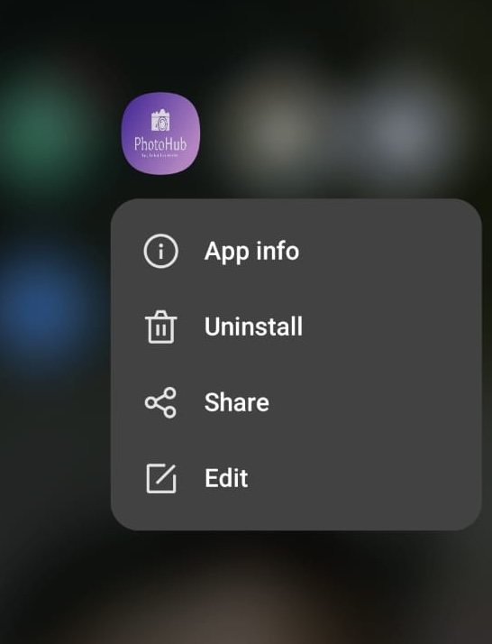
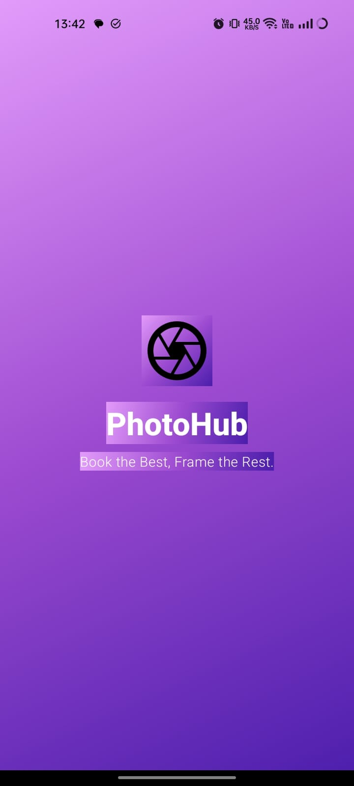
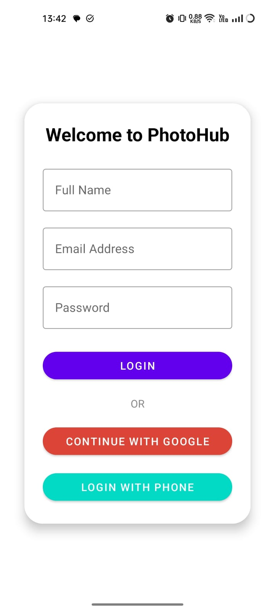
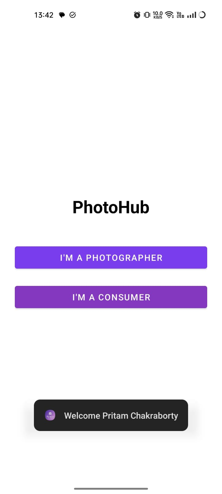
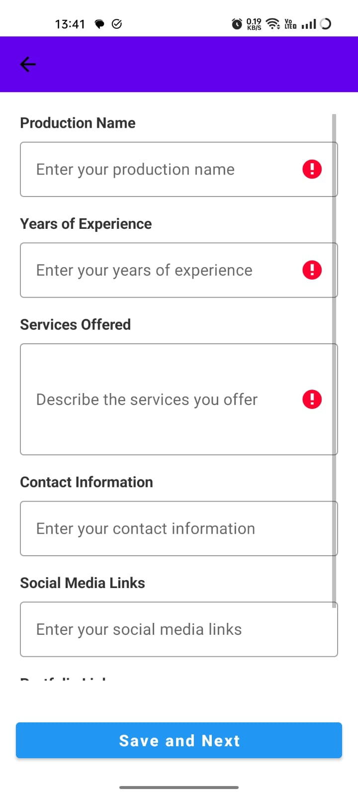
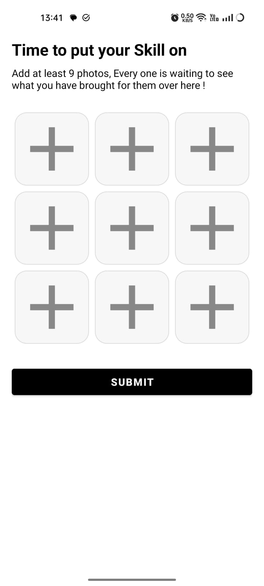
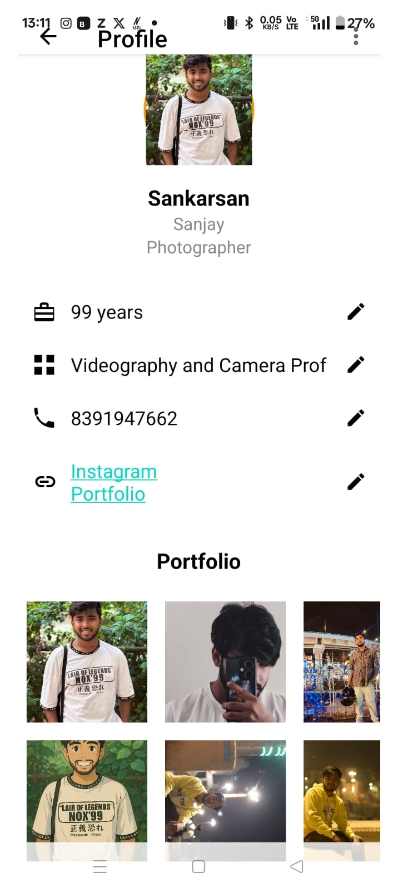
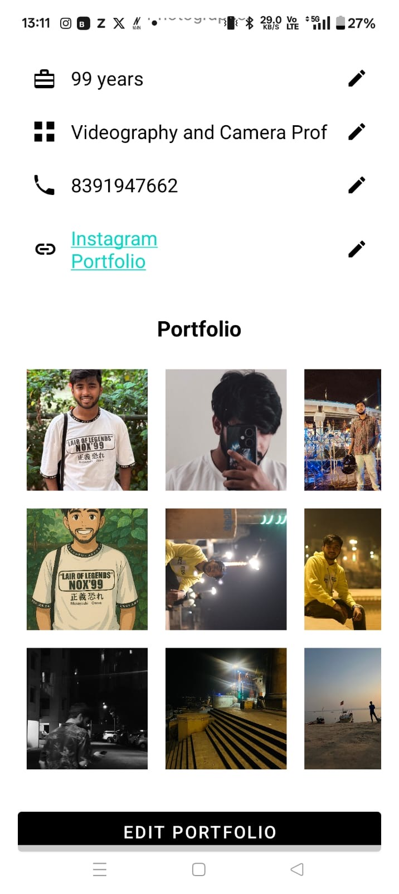
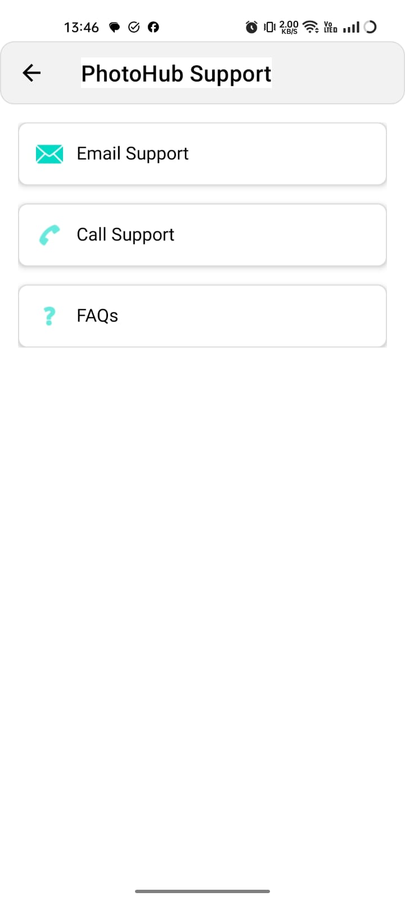

# 📷 PhotoHub – Zomato for Photographers

PhotoHub is an Android application built with Firebase, Room DB, and Material UI that connects photographers with clients who want to browse portfolios and book event-based services (e.g., weddings, parties, shoots).

---

## 🔧 Tech Stack

- 💻 **Android** (Java + XML)
- 🔥 **Firebase** (Auth + Realtime Database)
- 🗂 **Room Database**
- 🎨 **Material UI**
- ☁️ **Google Sign-In & Phone Auth**
- 📦 **Base64 Image Uploading**

---

## 🎯 Features

- 📱 **Login with Google or Phone OTP**
- 🧍‍♂️ **Photographer registration form**
- 🖼 **Upload 9-image portfolio**
- 📤 **Store photographer info to Firebase**
- 🛠 **Photographer dashboard with editable info**
- 👥 **Consumer browsing interface**
- 🖼 **Photographer detail page with full portfolio**
- 🎨 Modern UI with Light Mode and smooth animations

---

## 📸 Screenshots
| Logo | SplashScreen |
|--------------|-------------------|
|  | 

| Login Screen | Landing Page |
|--------------|-------------------|
|  |  |

| Phtographer Form | Portfolio upload |
|------------------|------------------------|
|  |  |

| Consumer Browsing | Photographer Detail Page |
|-------------------|--------------------------|
|  | .jpeg) |

| Photographer Dashboard 1 | Photographer Dashboard 2 |
|-------------------|--------------------------|
|  |  |

| Support |
|-------------------|
|  | 

---

